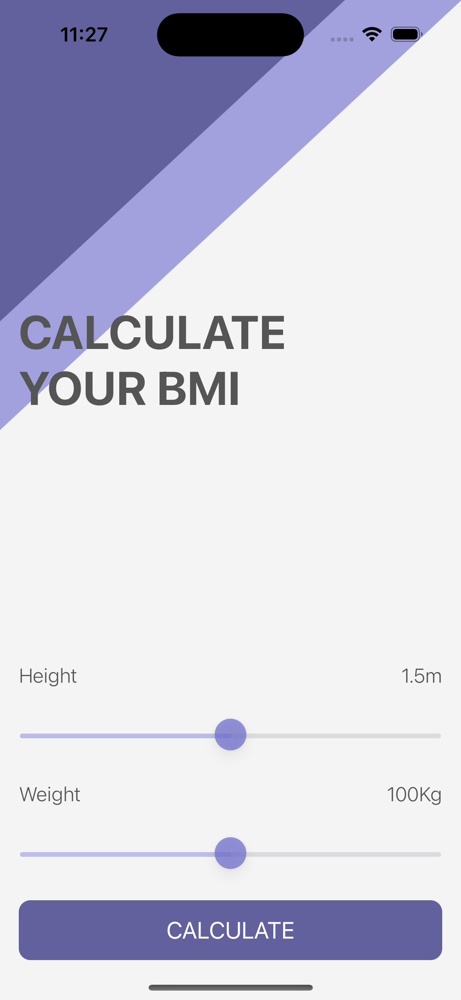
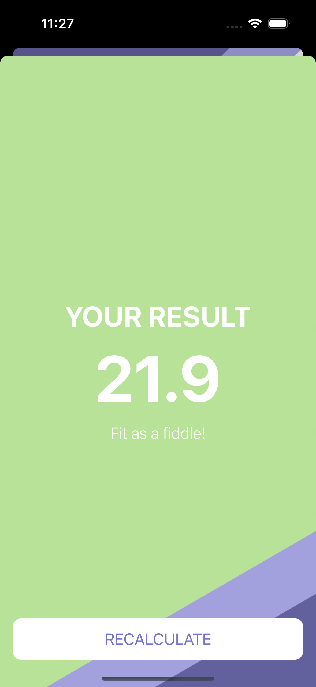

#  BMI Calculator

## Goal

Learn more about Optionals, 
Solidify your understanding of the MVC design pattern
Structs

## What you will learn

* How to create multi-screen apps with animated navigation.
* Optional binding, optional chaining and the nil coalescing operator.
* Formatting Strings. 
* Color literals.

##
All the content is created with the help of AppBrewery course on Udemy
